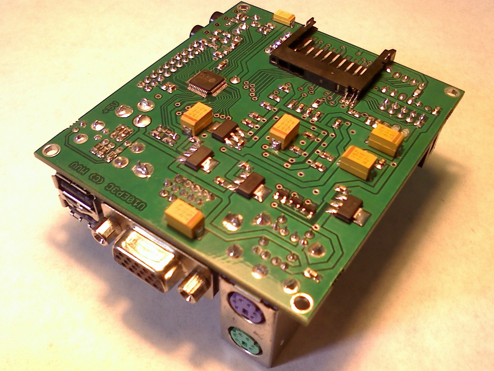
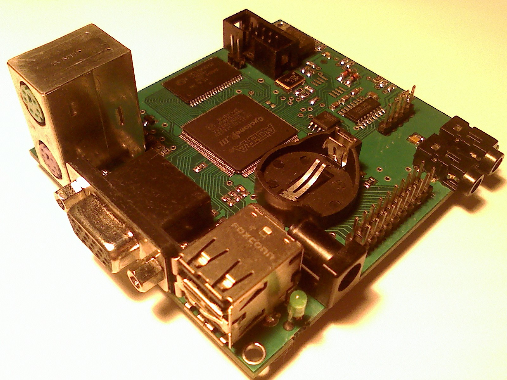

# ReVerSE-U10
Development Kit

 
Платформа ориентированна на создание SoC систем на микросхеме программируемой логики ПЛИС. Отлично подходит для домашнего обучения и позволяет полностью воссоздать множество ретро-компьютеров.

Схема реализуемого устройства задается прошивкой, записываемой в статическую память микросхемы ПЛИС. Микросхема ПЛИС представляет собой массив логических элементов, таким образом, существует возможность исправления ошибок схемы, а также добавления новых устройств, с помощью перепрошивки ПЛИС (выполняемой средствами самого устройства, либо через USB-кабель). 

Системы-на-кристалле потребляют меньше энергии, стоят дешевле и работают надёжнее, чем наборы микросхем с той же функциональностью. В отличие от обычных цифровых микросхем, логика работы ПЛИС не определяется при изготовлении, а задаётся посредством программирования (проектирования).

Для программирования используются программаторы и отладочные среды, позволяющие задать желаемую структуру цифрового устройства в виде принципиальной электрической схемы или программы на специальных языках описания аппаратуры: Verilog, VHDL, AHDL и др. В конфигурации ПЛИС реализуются почти все компоненты компьютера. Вне ПЛИС находятся только оперативная память, аппаратные интерфейсы для подключения клавиатуры, мыши, монитора, и других устройств.

#### Спецификация:
- FPGA Altera EP3C10E144C8N (supports Cyclone III EP3C5)
- SRAM 512KB х 8 bit (supports 2048 КB)
- SPI FLASH 4 Mb (supports 1/4/16/64 Mb)
- JTAG Mode and AS Mode are supported
- SD card socket (The Full-Speed card supports SPI, 1-bit SD and the 4-bit SD transfer modes)
- 16-pin Expansion Header
- Two USB port
- PS/2 keyboard/mouse
- PS/2 moude/keyboard
- 50-MHz oscillator
- Stereo Audio phone jack
- Audio Codec VS1053b Ogg Vorbis/MP3/AAC/WMA/FLAC/MIDI
- RS232
- VGA RGB(3:3:3) resistor-network DAC with 15-pin high-density D-sub connector
- RTC (Real Time Clock)
- Power DC +5V 500 mA
- PCB Size 75 х 84 mm

#### Вид платы:

